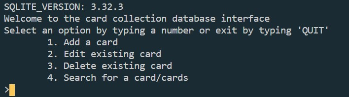
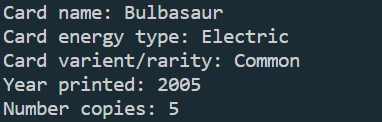
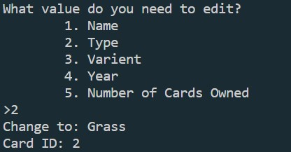
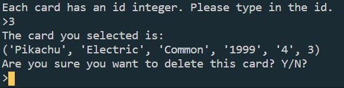
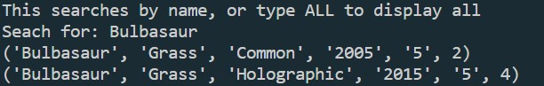
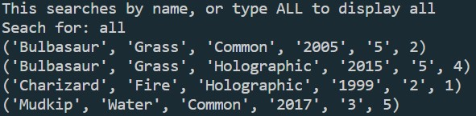

# This program uses Python 3.8.6

This is my first attemt at using databases, in this case, SQLite in Python. This was born out of my wife and I's massive card colelction and a way to cataloge all of it in one place. This was harder than I was expecting, but databases are so cool that I'll be happy to work on them again. That being said, this isn't the best implementation and i am not satisfied with the way I handle ID's. This will be fixed in later versions. For now, it provides and interface to add cards, modify details about the cards, delete cards, and seach for cards by name. It's also designed to only handle Pokemon trading cards at the moment. I would also liek to add more error handling, but for now, this will do for a basic version. 

## Execution

To run the program `card_colelction_interface.py`

You may open with [Python 3.8.6](https://www.python.org/) with your development envornment of choice. I shall use Visual Studio Code (VS Code) as that is what I'm familar with and prefer using.

1. Make sure that [Python 3.8.6](https://www.python.org/) is installed and set up with your development envornment. VS Code  will suggest a python extension if Python is already installed. 

2. Set up a virtual envornment via the teminal (VS Code). This can be done via the following command "py -m venv venv" wich will make a copy of the current version of Python being used for the hello world program.

3. Run the program. this can be done by pressing  F5 or Ctrl+F5 to run without debugging.

4. SQLite is built into Python, so no install for it will be needed. The output will be like this.

5. Select an option by selecting a number from 1-4. Typing quit or q will close the database and program. 

6. We can add to the database by typing 1, and the program will prompt you for all the details, as shown below.

7. We can edit a card by typing 2. It will then ask what column to change, then the change, and fially the card id.

8. We can delete a card by typing 3. It will promnt for the card id, and tell you what the card is. Comfirm the deletion by typing y.

9. We can search for cards by typing 4. The only way to do it currently is by name, or type all to display all.

   
#### Iplan to update this one more often, as I like working with ths program, and there are some flaws after going over this that I would like to remedy. 